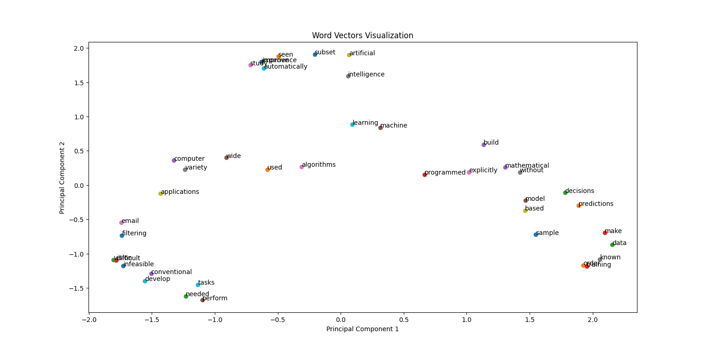

First I used Dense layer with linear activation and second dense layer with softmax activation.  
Let 
v: vocablury_size    
n: no_units_in_first_dense_layer.   
W matrix: V x n is the center_word matrix.  
W' matrix: n x V is the context_word matrix.   
  
So output equation is  
<b>Y = softmax(W'* W* X).  </b>  
This is actually the probability of context_word given center_word.   
and n is the size of word_embeddings. I have used n = 64.   
  
To plot the 2-D graph we have reduce diamentions of word_embeddings to 2.    
 

